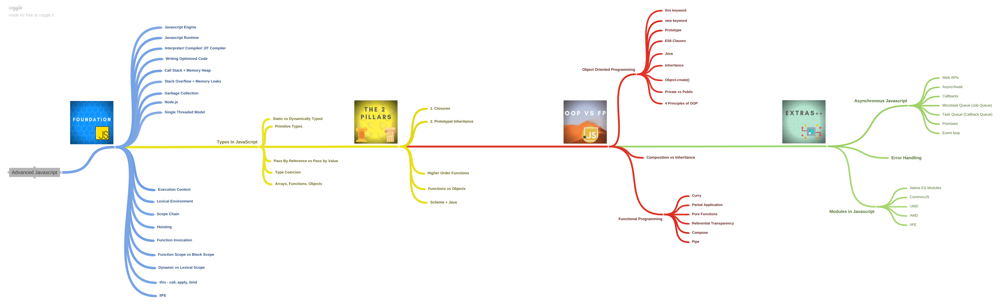

## JavaScript Deep Dive

Collection of articles and reading material to better understand javascript at an advance level.

#### Roadmap

#### When it all started

1. [How does JavaScript and JavaScript engine work in the browser and node?](https://medium.com/jspoint/how-javascript-works-in-browser-and-node-ab7d0d09ac2f) *- Uday Hiwarale*
2. [A New Crankshaft for V8](https://blog.chromium.org/2010/12/new-crankshaft-for-v8.html) *- Chromium Blog*
3. [A crash course in just-in-time (JIT) compilers](https://hacks.mozilla.org/2017/02/a-crash-course-in-just-in-time-jit-compilers/) *- Lin Clark*
4. [Javascript runtime visualizer - Loupe](http://latentflip.com/loupe/?code=ZnVuY3Rpb24gcHJpbnRIZWxsbygpIHsKICAgIGNvbnNvbGUubG9nKCdIZWxsbyBmcm9tIGJheicpOwp9CgpmdW5jdGlvbiBiYXooKSB7CiAgICBzZXRUaW1lb3V0KHByaW50SGVsbG8sIDMwMDApOwp9CgpmdW5jdGlvbiBiYXIoKSB7CiAgICBiYXooKTsKfQoKZnVuY3Rpb24gZm9vKCkgewogICAgYmFyKCk7Cn0KCmZvbygpOw%3D%3D!!!PGJ1dHRvbj5DbGljayBtZSE8L2J1dHRvbj4%3D) *- Philip Roberts*
5. [Abstract Syntax Tree (AST) Explorer](https://astexplorer.net/) *- [Github](https://github.com/fkling/astexplorer)*
6. [How JavaScript Works: Under the Hood of the V8 Engine](https://www.freecodecamp.org/news/javascript-under-the-hood-v8/) *- Ilya Lyamkin*

